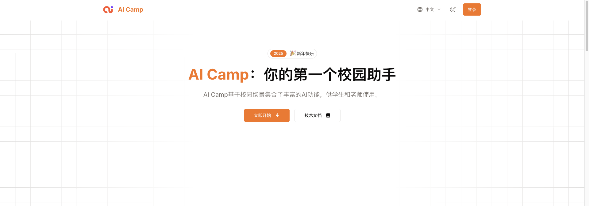

# AI-Powered Educational Tools Platform

A comprehensive platform offering intelligent educational tools for teachers and students.



## Overview

This platform provides a collection of AI-powered tools organized into four categories designed to enhance teaching and learning experiences:

### 1. 智慧课堂 (Smart Classroom)
Tools to assist with classroom teaching and lesson preparation:
- 教案设计 (Lesson Plan): Generate structured lesson plans based on specific knowledge points
- 教学材料 (Teaching Materials): Create comprehensive teaching materials
- 选择题 (Quiz): Generate quizzes with customized questions

### 2. 百科大全 (Knowledge Encyclopedia)
Tools for exploring and expanding knowledge:
- 概念背景 (Concept Background): Provide concise explanations of complex concepts
- 句子扩写 (Sentence Expansion): Expand sentences to target word counts with added details

### 3. 创意工坊 (Creativity Lab)
Tools to boost creativity and communication:
- 专业邮件 (Professional Email): Generate professional emails for various contexts
- 每日金句 (Daily Quote): Create inspirational quotes for specific purposes
- 有效沟通 (Effective Communication): Provide communication strategies for different scenarios

### 4. 心灵成长 (Mindful Growth)
Tools for personal growth and reflection:
- 心灵镜像 (Mind Mirror): Analyze emotional states and provide supportive responses

## Quick Start

1. Clone the repository

```bash
git clone <repository-url>
```

2. Install dependencies

```bash
pnpm install
```

3. Run the development server

```bash
pnpm dev
```

## Adding New Tools

Please refer to the `add-tools.md` guide in the root directory for detailed instructions on adding new tools to the platform.

The process involves:
1. Creating a tool definition file
2. Registering the tool in the registry
3. Adding the tool to the backup mapping
4. Creating a dedicated page file
5. Restarting the development server

## Customization

- Set your environment variables:

```bash
cp .env.example .env.local
```

- Customize the UI theme in `app/theme.css`

- Modify i18n messages in `i18n/messages`

## Deploy

- Deploy to Vercel:

[](https://vercel.com/new/clone)

- Deploy to Cloudflare:

```bash
cp .env.example .env.production
cp wrangler.toml.example wrangler.toml
# Edit environment variables
npm run cf:deploy
```

## License

This project is licensed under the terms specified in the [LICENSE](LICENSE) file.
